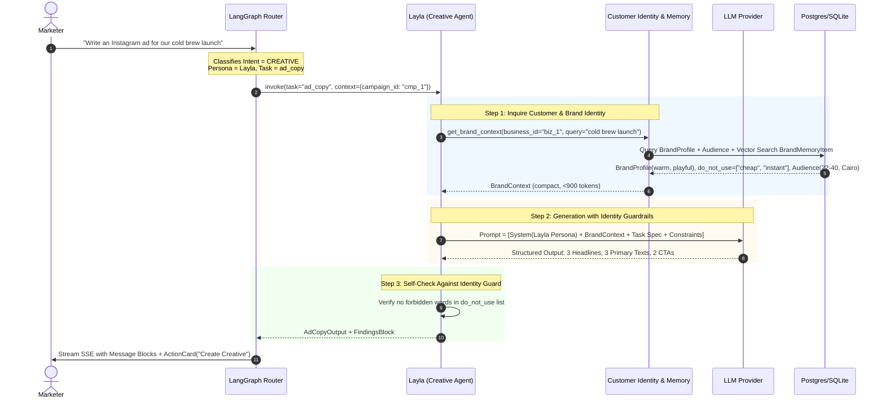
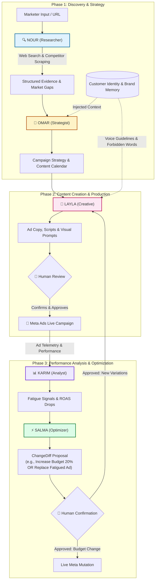
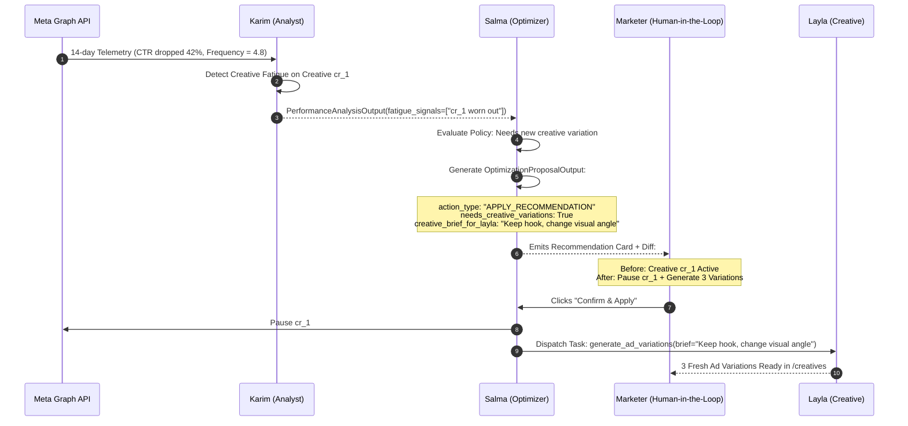

# Multi-Agent Architecture & Implementation Plan

> **Document:** `AGENTS_ARCHITECTURE_PLAN.md`  
> **Status:** SPECIFICATION READY FOR PARALLEL EXECUTION  
> **Target Framework:** LangGraph + FastAPI + Pydantic v2 + SQLAlchemy 2.0 Async  
> **Frontend Integration:** Next.js 14 App Router (`/assistant`, `/research`, `/campaigns`, `/calendar`, `/creatives`, `/agents`)  

---

## 1. Executive Summary

This document defines the complete architectural blueprint, schemas, inter-agent communication protocols, and a **5-developer parallel execution plan** for the 5 specialized AI agents powering the **Sahm Marketing Operating System**:

```
+─────────────────────────────────────────────────────────────────────────────────────────+
|                                    ORCHESTRATOR HUB                                     |
|           Classifies User Intent -> Injects Shared Brand/Customer Identity              |
|                     Routes to Persona -> Dispatches Action Cards                        |
+─────────────────────────────────────────────────────────────────────────────────────────+
         │                         │                        │                        │
         ▼                         ▼                        ▼                        ▼
+─────────────────+       +─────────────────+      +─────────────────+      +─────────────────+
|  1. NOUR (🔍)   |       |  2. OMAR (🧭)   |      |  3. LAYLA (🎨)  |      | 4. KARIM (📊)   |
|   Researcher    |       |   Strategist    |      |    Creative     |      |    Analyst      |
| Market & Comps  |       | Strategy & Cal  |      | Content & Copy  |      | Metrics & Health|
+─────────────────+       +─────────────────+      +─────────────────+      +─────────────────+
                                                                                     │
                                                                                     ▼
                                                                            +─────────────────+
                                                                            |  5. SALMA (⚡)   |
                                                                            |    Optimizer    |
                                                                            |  Recs & Diffs   |
                                                                            +─────────────────+
```

### Core Problems Solved
1. **Isolated Agent Silos:** Prevents the Content Generation Agent (Layla) from writing generic copy by enforcing a **Customer Identity & Brand Context Injection Protocol**.
2. **Context Bleed & Infinite Loops:** Replaces unconstrained agent-to-agent chatter with a structured **Blackboard Pattern** mediated by LangGraph and Human-in-the-Loop **Action Cards**.
3. **Team Execution Gridlock:** Divides the 5 agents into **5 independent parallel tasks** with isolated tool registries, mock contracts, and isolated prompt templates.

---

## 2. The 5 Marketing Agents

| Agent Persona | Role | Primary Objective | Tone & Autonomy | Allowed Tools | Input Context Needed | Output Artifacts |
|---|---|---|---|---|---|---|
| **Nour** (🔍) | `researcher` | Uncover verifiable market truth, competitor ads, keywords, customer reviews, and market gaps. | `professional`<br>`auto_draft` | `web_search`, `analyze_website`, `get_social_profile`, `get_reviews`, `get_keywords`, `get_competitor_ads`, `get_brand_context`, `save_learning` | Target URL, keyword seed, competitor handle | `CompetitorResearchOutput`, `MarketAnalysisOutput`, `MarketGapsOutput`, `FindingsBlock` |
| **Omar** (🧭) | `strategist` | Convert research evidence and brand goals into positioning, channel budget splits, and content calendars. | `bold`<br>`suggest` | `get_brand_context`, `generate_marketing_strategy`, `generate_campaign_strategy`, `generate_content_calendar`, `save_learning` | Business goals, research findings, budget cap | `MarketingStrategyOutput`, `CampaignStrategyOutput`, `ContentCalendarOutput` |
| **Layla** (🎨) | `creative` | Generate ad copy, visual briefs, commercial scripts, and image prompts strictly in the brand's voice. | `playful`<br>`auto_draft` | `get_brand_context`, `analyze_reference_creative`, `generate_image`, `generate_ad_copy`, `generate_ad_variations` | Customer Identity, Brand Voice, forbidden words, reference ad | `CreativeBriefOutput`, `CommercialScriptOutput`, `ImagePromptOutput`, `AdCopyOutput`, `AdVariationsOutput` |
| **Karim** (📊) | `analyst` | Monitor Meta Ads delivery, detect creative fatigue, CTR/ROAS anomalies, and report exact numbers. | `minimal`<br>`auto_draft` | `get_brand_context`, `get_campaign_insights`, `get_breakdowns`, `save_learning` | Campaign ID, Meta telemetry, date range | `PerformanceAnalysisOutput`, `PerformanceFinding`, `MetricBlock` |
| **Salma** (⚡) | `optimizer` | Propose precise, approvable mutations (budget adjustments, pausing fatigued ads, dispatching variations to Layla). | `professional`<br>`ask_first` | `get_brand_context`, `get_campaign_insights`, `get_breakdowns`, `create_recommendation` | Karim's analysis, budget caps, ROAS target | `OptimizationProposalOutput`, `Recommendation`, `ChangeDiff[]` |

---

## 3. Schemas & Data Contracts ("What Schema Should We Follow")

To guarantee contract parity across all 5 developers, every agent complies with 4 foundational schemas.

### Schema A: Shared Orchestrator State (`OrchestratorState` / Blackboard)
The single mutable dictionary carried across the LangGraph execution graph:

```python
from typing import Any, TypedDict

class OrchestratorState(TypedDict, total=False):
    # Session & Thread Boundaries
    conversation_id: str
    business_id: str
    workspace_id: str
    request_id: str
    
    # User Inputs & Injected Context
    user_message: str
    context: dict[str, Any]             # Sticky chips: {campaign_id, creative_id, insight_id}
    brand_context_ref: str | None       # Cache key for assembled customer identity
    
    # Classification & Routing
    intent: str                         # "research" | "strategy" | "creative" | "analyze" | "optimize"
    intent_confidence: float
    persona_id: str                     # "researcher" | "omar" | "layla" | "karim" | "salma"
    task_name: str                      # Exact task spec to execute
    missing_info: list[str]             # Required parameters absent from user turn
    clarification: dict[str, Any] | None
    
    # Inter-Agent Results & Handoffs
    agent_results: list[dict[str, Any]] # Prior agent findings in this session
    agent_result: dict[str, Any] | None  # Current agent output
    pending_actions: list[dict[str, Any]]# ActionRef cards emitted for human confirmation
    
    # UI Renderables
    blocks: list[dict[str, Any]]        # Message blocks returned to frontend SSE stream
    error: str | None
```

### Schema B: Customer Identity & Brand Context (`BrandContext`)
When any agent generates consumer-facing output (especially Layla or Omar), it must read `BrandContext` retrieved from the database and vector store:

```python
from pydantic import BaseModel, Field

class BrandProfileContext(BaseModel):
    name: str                           # e.g., "Nile Roasters"
    industry: str                       # e.g., "Specialty Coffee / D2C"
    voice_tones: list[str]              # e.g., ["warm", "confident", "playful"]
    brand_values: list[str]             # e.g., ["craft", "locality", "sustainability"]
    tagline: str | None
    do_not_use: list[str]               # Words the LLM must NEVER use (e.g. ["cheap", "discount"])
    languages: list[str]                # ["en", "ar"]

class TargetAudienceContext(BaseModel):
    name: str                           # e.g., "Cairo Specialty Coffee Enthusiasts"
    age_range: tuple[int, int]          # (22, 45)
    genders: list[str]                  # ["all"]
    locations: list[str]                # ["Cairo, EG", "Giza, EG"]
    interests: list[str]                # ["Specialty coffee", "Brunch", "Artisan roasting"]
    pain_points: list[str]              # ["Stale supermarket beans", "Inconsistent grind"]

class BrandMemoryEvidence(BaseModel):
    kind: str                           # "voice_example" | "winning_hook" | "learning"
    text: str
    similarity_score: float

class BrandContext(BaseModel):
    business_id: str
    brand: BrandProfileContext
    audience: TargetAudienceContext | None
    retrieved_memory: list[BrandMemoryEvidence] = Field(default_factory=list)
    token_count: int = Field(le=900)   # Hard token ceiling to prevent context bloating
```

### Schema C: Standard Task Output Base (`TaskOutputBase`)
Every agent's structured output inherits from `TaskOutputBase`, enforcing factual grounding and flagging unavailable data:

```python
class Evidence(BaseModel):
    claim: str
    source_tool: str                    # Tool that provided this claim (e.g., "analyze_website")
    source_uri: str                     # URL, ad account ID, or document reference
    confidence: float = Field(ge=0.0, le=1.0)

class TaskOutputBase(BaseModel):
    summary: str
    evidence: list[Evidence] = Field(default_factory=list)
    unavailable_sources: list[str] = Field(default_factory=list)
    notes: str = ""
```

### Schema D: Interactive UI Blocks (`MessageBlock`)
Agents do not just reply with markdown text; they output structured blocks for the frontend chat:

```python
# Discriminated union on "type"
# 1. Text: {"type": "text", "text": "...", "streaming": false}
# 2. Findings: {"type": "findings", "title": "...", "items": [{"label", "detail", "sentiment"}]}
# 3. Metric: {"type": "metric", "metrics": [{"label", "value", "delta", "format"}]}
# 4. Recommendation: {"type": "recommendation", "recommendation": {"id", "changes": [...]}}
# 5. ActionCard: {"type": "action_card", "title": "...", "actions": [{"type", "payload"}]}
# 6. TaskProgress: {"type": "task_progress", "taskId": "...", "task": {...}}
# 7. QuestionWithOptions: {"type": "question_with_options", "question": "...", "options": [...]}
```

---

## 4. How Everything Integrates & Communicates

The system uses a **Hybrid Blackboard & Action Card Pattern**:
- **Shared Read:** All agents read customer identity, brand voice, and prior findings via `BrandMemoryStore`.
- **Handoffs:** When Agent A needs Agent B, it either:
  1. **Direct Pipeline Handoff (Single Turn):** The orchestrator feeds Agent A's output directly into Agent B's prompt inputs.
  2. **Human-in-the-Loop Handoff (Multi-Turn):** Agent A produces an `action_card` with a pre-filled payload for Agent B. The user clicks "Apply" or "Generate", triggering Agent B.

### Interaction 1: Layla (Creative) Communicating with Customer Identity



---

### Interaction 2: End-to-End Collaborative Marketing Loop (All 5 Agents)



---

### Interaction 3: Karim (Analyst) -> Salma (Optimizer) -> Layla (Creative) Flow



---

## 5. Parallel Execution Plan — 5 Developer Tasks

To ensure the team can build all 5 agents concurrently without blocking each other, each task is strictly bounded by:
- A specific **Persona instance** in `app/core/agents/personas.py`.
- Dedicated **TaskSpecs and Output Models** in `app/core/agents/tasks.py`.
- Dedicated **Tool classes** in `app/core/tools/`.
- Isolated **Prompt templates** in `app/core/agents/prompts/`.

```
┌────────────────────────────────────────────────────────────────────────────────────────┐
│                        DEVELOPER PARALLEL ASSIGNMENT MATRIX                            │
├──────────────┬──────────────────┬─────────────────────────────┬────────────────────────┤
│ Developer    │ Assigned Agent   │ Primary Tool Module         │ Core Output Model      │
├──────────────┼──────────────────┼─────────────────────────────┼────────────────────────┤
│ Developer 1  │ Nour (Research)  │ app/core/tools/research.py  │ CompetitorResearchOut  │
│ Developer 2  │ Omar (Strategy)  │ app/core/tools/strategy.py  │ CampaignStrategyOutput │
│ Developer 3  │ Layla (Creative) │ app/core/tools/media.py     │ CreativeBriefOutput    │
│ Developer 4  │ Karim (Analyst)  │ app/core/tools/meta_read.py │ PerformanceAnalysisOut │
│ Developer 5  │ Salma (Optimizer)│ app/core/tools/protected.py │ OptimizationProposalOut│
└──────────────┴──────────────────┴─────────────────────────────┴────────────────────────┘
```

---

### Task 1 (Developer 1): Build Nour (The Researcher) & Web Intelligence Engine

**Goal:** Create the research agent that gathers market truth, scans competitor websites, analyzes reviews, and identifies market gaps.

- **Files Owned:**
  - `SAHM-AI-backend/app/core/tools/research.py`
  - `SAHM-AI-backend/app/core/agents/prompts/competitor_research.txt`
  - `SAHM-AI-backend/app/core/agents/prompts/market_analysis.txt`
  - `SAHM-AI-backend/app/core/agents/prompts/market_gaps.txt`
  - `SAHM-AI-backend/tests/test_agent_nour.py` (new)
- **Tools to Implement:**
  1. `WebSearchTool` (`web_search`): Queries Tavily / Serper API with mock fallback.
  2. `AnalyzeWebsiteTool` (`analyze_website`): Scrapes target URL using BeautifulSoup with SSRF validation (`resolve_and_check`).
  3. `GetReviewsTool` (`get_reviews`): Extracts positive/negative sentiments and pain points.
  4. `GetKeywordsTool` (`get_keywords`): Queries DataForSEO / mock keyword volume.
  5. `GetCompetitorAdsTool` (`get_competitor_ads`): Scans ad creatives and messaging hooks.
- **Pydantic Outputs to Implement:**
  - `CompetitorProfile`, `CompetitorResearchOutput`
  - `AudienceSegment`, `MarketAnalysisOutput`
  - `Gap`, `MarketGapsOutput`
- **Step-by-Step Implementation:**
  1. Implement `research.py` tools inheriting from `Tool` with typed `args_schema`.
  2. Add SSRF protection: reject internal network ranges (`10.0.0.0/8`, `127.0.0.1`, `169.254.169.254`).
  3. Author prompt templates in `prompts/` using `{{slot}}` syntax.
  4. Register tools in `app/core/tools/registry.py` under the `researcher` persona.
- **Test Strategy:**
  - Mock HTTP responses with `respx`.
  - Verify that if a URL fails to load, `unavailable_sources` lists the URL and the agent does not invent fake statistics.

---

### Task 2 (Developer 2): Build Omar (The Strategist) & Calendar Planner

**Goal:** Create the strategist agent that transforms research evidence into structured campaign strategies and multi-channel content calendars.

- **Files Owned:**
  - `SAHM-AI-backend/app/core/tools/strategy.py` (new)
  - `SAHM-AI-backend/app/core/agents/prompts/marketing_strategy.txt`
  - `SAHM-AI-backend/app/core/agents/prompts/campaign_strategy.txt`
  - `SAHM-AI-backend/app/core/agents/prompts/content_calendar.txt`
  - `SAHM-AI-backend/tests/test_agent_omar.py` (new)
- **Tools to Implement:**
  1. `GenerateMarketingStrategyTool`: Synthesizes positioning, value propositions, and 90-day execution phases.
  2. `GenerateCampaignStrategyTool`: Allocates daily budgets across Facebook, Instagram, Messenger, and Audience Network based on objectives (`awareness`, `traffic`, `sales`).
  3. `GenerateContentCalendarTool`: Generates weekly scheduled posts across Instagram, Facebook, and TikTok.
- **Pydantic Outputs to Implement:**
  - `ChannelPlan`, `MarketingStrategyOutput`
  - `CampaignStrategyOutput` (matching `CampaignStrategySchema` in frontend: `summary`, `keyMessages`, `channels`, `placements`, `biddingStrategy`, `phases`, `kpis`).
  - `ContentCalendarOutput` (matching `ContentItemSchema`).
- **Step-by-Step Implementation:**
  1. Ensure Omar always invokes `get_brand_context` before drafting strategy.
  2. Implement mathematical budget split validation: sum of channel percentages must equal 1.0 (100%).
  3. Ensure calendar generation respects the requested `postsPerWeek` (2–7) and target channels.
- **Test Strategy:**
  - Feed mock `CompetitorResearchOutput` into Omar.
  - Verify generated strategy adheres to target audience demographic bounds.

---

### Task 3 (Developer 3): Build Layla (The Creative) & Customer Identity Integration

**Goal:** Create the creative engine that reads customer identity and generates brand-compliant ad copy, scripts, prompts, and visual specs.

- **Files Owned:**
  - `SAHM-AI-backend/app/core/tools/media.py`
  - `SAHM-AI-backend/app/core/agents/prompts/creative_brief.txt`
  - `SAHM-AI-backend/app/core/agents/prompts/ad_copy.txt`
  - `SAHM-AI-backend/app/core/agents/prompts/commercial_script.txt`
  - `SAHM-AI-backend/app/core/agents/prompts/ad_variations.txt`
  - `SAHM-AI-backend/tests/test_agent_layla.py` (new)
- **Tools to Implement:**
  1. `AnalyzeReferenceCreativeTool`: Deconstructs uploaded base64 / URL ad into `ReferenceAnalysis` (hook, visual style, tone, structure, strengths, weaknesses, `inspiredBrief`).
  2. `GenerateImageTool`: Synthesizes prompt with brand color palette and invokes image provider (DALL-E 3 / Stability).
  3. `GenerateAdCopyTool`: Produces headlines, primary texts, and CTAs in the requested language (`en` or `ar`).
  4. `GenerateAdVariationsTool`: Modifies visual angle or hook while preserving the core offer.
- **Customer Identity Enforcement Protocol:**
  - **Injected Brand Voice:** Layla must read `brand.voice_tones` and mirror the style.
  - **Forbidden Words Filter:** Layla must run a regex check against `brand.do_not_use`. If any forbidden word appears, trigger one automatic repair retry with a penalty.
- **Pydantic Outputs to Implement:**
  - `CreativeBriefOutput`, `CommercialScriptOutput`, `ImagePromptOutput`, `VideoPromptOutput`, `AdCopyOutput`, `AdVariationsOutput`.
- **Test Strategy:**
  - Test Arabic and English generation.
  - Test that forbidden words (e.g. "cheap") are rejected and repaired automatically.

---

### Task 4 (Developer 4): Build Karim (The Analyst) & Telemetry Pipeline

**Goal:** Create the analytics agent that queries Meta Graph API telemetry, tracks KPI progress, and detects creative fatigue.

- **Files Owned:**
  - `SAHM-AI-backend/app/core/tools/meta_read.py`
  - `SAHM-AI-backend/app/core/agents/prompts/performance_analysis.txt`
  - `SAHM-AI-backend/tests/test_agent_karim.py` (new)
- **Tools to Implement:**
  1. `GetCampaignInsightsTool`: Fetches impressions, reach, clicks, CTR, CPC, CPM, conversions, CPA, ROAS, and spend from Meta.
  2. `GetBreakdownsTool`: Slices metrics by age, gender, region, and placement.
  3. `DetectFatigueTool`: Calculates rolling CTR degradation and frequency saturation (> 3.5).
  4. `SaveLearningTool`: Stores persistent performance takeaways into `BrandMemoryItem` (e.g., "UGC videos achieved +45% CTR over static images for Cairo audience").
- **Pydantic Outputs to Implement:**
  - `PerformanceFinding` (with severity: `info`, `warning`, `critical`).
  - `PerformanceAnalysisOutput` (with `fatigue_signals` and `headline_metrics`).
- **Step-by-Step Implementation:**
  1. Implement exact metric formulas: $CTR = \frac{Clicks}{Impressions} \times 100$, $CPC = \frac{Spend}{Clicks}$, $ROAS = \frac{Revenue}{Spend}$.
  2. Build deterministic fatigue heuristics.
  3. Ensure Karim never invents numbers: missing metrics must be explicitly reported as `"not available"`.
- **Test Strategy:**
  - Provide synthetic 14-day metric arrays with declining CTR and rising frequency; verify fatigue signal triggers.

---

### Task 5 (Developer 5): Build Salma (The Optimizer), LangGraph Router & Communication Hub

**Goal:** Create the optimization agent, LangGraph state machine, intent router, and SSE streaming pipeline connecting all 5 agents.

- **Files Owned:**
  - `SAHM-AI-backend/app/core/orchestrator/graph.py`
  - `SAHM-AI-backend/app/core/orchestrator/router.py`
  - `SAHM-AI-backend/app/core/orchestrator/blocks.py`
  - `SAHM-AI-backend/app/core/tools/protected.py`
  - `SAHM-AI-backend/app/core/agents/prompts/optimization_proposal.txt`
  - `SAHM-AI-backend/tests/test_orchestrator_graph.py`
- **Responsibilities to Implement:**
  1. **LangGraph StateGraph:** Build the conditional graph:
     `START -> _classify_node -> [researcher | omar | layla | karim | salma | clarification] -> _compose_node -> END`.
  2. **Intent Classifier (`router.py`):** Few-shot prompt classifying natural language into intent kinds (`research`, `strategy`, `creative`, `analyze`, `optimize`).
  3. **Salma Optimization Tool (`protected.py`):**
     - Emits `ChangeDiff` (e.g., `{field: "dailyBudget", before: 500, after: 750}`).
     - If creative variations are needed, emits `needs_creative_variations=True` and drafts a brief for Layla.
  4. **Block Composer (`blocks.py`):** Transforms raw `TaskOutputBase` Pydantic objects into the frontend's discriminated union `MessageBlock` cards.
  5. **SSE Streaming Dispatcher:** Yields full `SendMessageOutput` snapshots via FastAPI `StreamingResponse`.
- **Test Strategy:**
  - Test end-to-end multi-agent routing from user query to composed UI blocks.
  - Verify that Salma never mutates live campaigns directly without generating a confirmation diff.

---

## 6. Implementation Schedule & Verification Grid

```
Day 1: Setup & Interfaces
  - Developer 1: Research tools + mock Tavily
  - Developer 2: Strategy schemas + prompt template
  - Developer 3: Creative prompts + forbidden word filter
  - Developer 4: Meta telemetry mock data + fatigue detector
  - Developer 5: LangGraph state structure + Intent classifier

Day 2: Core Agent Execution
  - Developer 1: Website scraping + SSRF validation
  - Developer 2: Budget split validator + Calendar generator
  - Developer 3: Reference ad analyzer + Image generator
  - Developer 4: Metrics breakdowns + Insight generator
  - Developer 5: Block composition (Findings, Metrics, Recs)

Day 3: Cross-Agent Integration
  - Connect Layla to BrandContext (Developer 3 & Developer 1)
  - Connect Salma to Karim's fatigue signals (Developer 4 & Developer 5)
  - Connect Omar to Nour's research findings (Developer 1 & Developer 2)

Day 4: End-to-End Chat & SSE Verification
  - Full LangGraph execution of all 5 personas
  - Verify streaming snapshot payloads to `/conversations/messages/stream`
  - Test Arabic and English output fidelity

Day 5: Production Hardening
  - Token budget caps enforcement (RunUsageTracker)
  - Timeout safety checks (180s cap)
  - Final test suite pass: uv run --extra dev pytest
```

---

## 7. Developer Kickoff Checklist

### Developer 1 (Nour - Research)
- [ ] Implement `web_search` and `analyze_website` with SSRF checking in `research.py`.
- [ ] Build `competitor_research.txt` prompt template.
- [ ] Verify `CompetitorResearchOutput` validates properly.

### Developer 2 (Omar - Strategy)
- [ ] Implement `generate_campaign_strategy` and `generate_content_calendar`.
- [ ] Enforce budget sum constraint (sum of channel weights == 1.0).
- [ ] Connect calendar generation to requested weekly frequency.

### Developer 3 (Layla - Creative & Identity)
- [ ] Integrate `get_brand_context` tool call into Layla's initial turn.
- [ ] Implement forbidden words scanner against `brand.do_not_use`.
- [ ] Build multimodal `AnalyzeReferenceCreativeTool` for video/image deconstruction.

### Developer 4 (Karim - Analyst)
- [ ] Implement `GetCampaignInsightsTool` querying impressions, CTR, CPC, ROAS.
- [ ] Build rolling frequency and CTR fatigue detection heuristics.
- [ ] Implement `SaveLearningTool` to write findings back into `BrandMemoryItem`.

### Developer 5 (Salma - Optimizer & Orchestrator)
- [ ] Wire LangGraph nodes: `classify` -> `agent_node` -> `compose_blocks`.
- [ ] Implement `create_recommendation` producing structured `ChangeDiff` objects.
- [ ] Ensure cross-agent handoffs generate `action_card` blocks with prefilled payloads.
